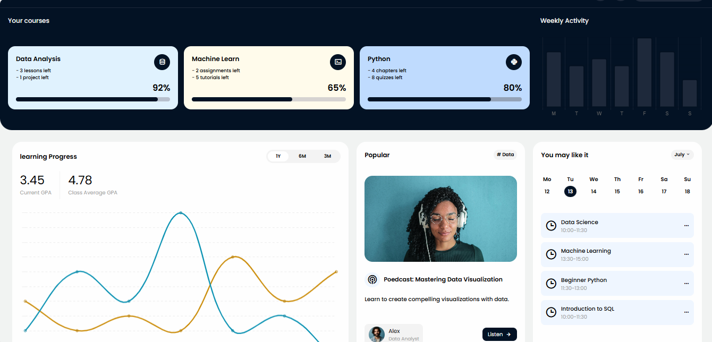

# responsive-dashboard-and-user-dashboard
 <div align="center">
  
</div>

## Overview
This project is a responsive user dashboard built using HTML, CSS, and JavaScript. The dashboard provides a clean and intuitive interface for users to view key metrics, manage tasks, or interact with data. It is designed to adapt seamlessly across various devices, including desktops, tablets, and mobile phones.

## Features

- Responsive Design: Adapts to different screen sizes for optimal user experience.
- Interactive Elements: Includes dynamic components such as toggles, modals, or charts powered by JavaScript.
- Modern Styling: Utilizes CSS for a sleek, professional appearance with smooth transitions and hover effects.
- Modular Structure: Organized codebase for easy customization and scalability.

<div align="center">
  
</div>
   
### Tools and Modules 


## Folder Structure
```
responsive-user-dashboard/
├── assets/
│   ├── images/       # Image assets
│   ├── css/          # CSS files (e.g., styles.css`)
│   └── js/           # JavaScript files (e.g., script.js`)
├── index.html        # Main HTML entry point
└── README.md         # Project documentation
```


## Browser Compatibility
The dashboard is compatible with modern browsers, including:
- Google Chrome
- Mozilla Firefox
- Safari
- Edge

For older browsers, some features may require polyfills or fallback styles.


## License
This project is licensed under the MIT License. See the [LICENSE](LICENSE) file for details.

